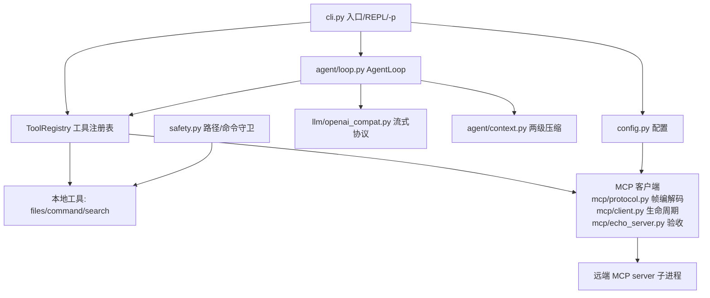

# mncc — mini Claude Code

> 终端里的 AI 编程助手：我用自然语言下达任务，它自主读写文件、搜索代码、执行命令、修改代码并验证，直到任务完成。
>
> 教学向"简历级"项目：**零 Agent 框架**，从零手写 Agent Loop、流式 Function Calling、两级上下文压缩、**手写 MCP 客户端**，并自建评测体系。

[](https://github.com/wanming1122/mncc/actions/workflows/ci.yml)

**当前状态：M6 完成** —— 手写 MCP 客户端（JSON-RPC over stdio，零 SDK）+ CI + 发布 + INTERVIEW.md + README 补全，306 项测试全绿（304 通过 + 2 跳过，含本机 `mcp__echo__echo` 端到端验收）。路线图见文末。

## 安装

```bash
# 开发环境
git clone <repo-url> && cd mncc
python -m pip install -e ".[dev]"

# 直接使用（GitHub 安装，无需克隆）
pipx install git+https://github.com/wanming1122/mncc.git
mncc --version
```

## 配置

API key 只从环境变量读取（不落盘），按顺序探测：`MNCC_API_KEY` → `OPENAI_API_KEY` → `ZHIPUAI_API_KEY` → `GLM_API_KEY`。

```bash
export MNCC_API_KEY=sk-xxx        # Git Bash
# setx MNCC_API_KEY sk-xxx         # CMD 持久化
```

可选配置文件（全局 `~/.mncc/config.toml`，项目目录 `.mncc.toml` 可覆盖）：

```toml
base_url = "https://open.bigmodel.cn/api/paas/v4/"   # GLM；DeepSeek: "https://api.deepseek.com"
model = "glm-4.6"
max_turns = 25
token_budget = 200_000
# api_key_env = "MY_KEY"   # 指定从哪个环境变量读 key
# ---- 以下三项为 M4 两级压缩配置，均可省略（走左侧默认值）----
model_context_limit = 128_000   # 模型上下文窗口上限（按所用模型调整）
compact_threshold = 0.8         # 估算用量超过窗口 80% 时触发 auto-compact
summary_max_tokens = 500        # 摘要输出 token 上限
# ---- M6：MCP 远端工具（可选；无此配置则 MCP 不启用）----
# mcp_servers = [{ name = "echo", command = "python", args = ["-m", "mncc.mcp.echo_server"] }]
```

环境变量 `MNCC_BASE_URL` / `MNCC_MODEL` 可临时覆盖；命令行 `--model` 优先级最高。
`mcp_servers` 校验：`name` 限 `[a-z0-9_-]+`（防命名空间注入）、`command` 非空、`args` 为字符串数组；
连接失败的 server 只在 stderr 警告并跳过，不拖垮主流程。

## 使用

```bash
mncc                       # 启动 REPL（工具模式：read_file / write_file / run_command）
mncc -p "修复测试"         # 非交互一次性执行；退出码 0=成功 1=失败 130=被中断
mncc -p "写点东西" --yolo  # 跳过写入确认（评测管线 / 脚本化调用必备）
```

评测记账：`mncc -p "任务" --yolo --stats-json out.json` 成功结束时把 轮数/token/耗时 落盘（bench runner 用它记录每任务开销）。

REPL 内：`/help` `/clear` `/model` `/context` `/compact` `/exit`；Ctrl+C 中断当前任务但不退出。

**工具集（M2）**：
- `read_file(path, offset?, limit?)`：带行号，最多 2000 行，超出提示分页
- `write_file(path, content)`：写入前展示预览并确认（`--yolo` 跳过）
- `run_command(cmd, timeout?)`：子进程执行，UTF-8 统一，超时强杀

**MCP 远端工具（M6）**：配置 `mcp_servers` 后，远端工具以
`mcp__<server>__<tool>` 名挂进同一工具注册表，自动具备 function calling + 确认门禁
（`needs_confirm` 默认开启，`--yolo` 跳过）+ 错误回填。验收示例（自带 echo server，
无需外部工具）：

```bash
mncc -p "调用 mcp__echo__echo 说你好" --yolo   # 回复应含回显"你好"
```

真实 MCP server 亦可接入（如官方 filesystem server：`npx` 起进程后
`mcp__filesystem__read_file` 等工具可用）。

## 跑分（bench，M5）

20 个小型确定性任务（bug 修复 ×6 / 小功能 ×6 / 重构 ×4 / 测试编写 ×4；易 6 / 中 9 / 难 5），
评测方法要点：**判分以终态 `pytest test.py` 全绿为准**（不以 `mncc` 退出码为准——记录模型
自报结果但用客观断言判分）；评分测试对 agent 全程隐藏（防"照抄测试当实现"）；每任务独立
临时目录 + 子进程隔离，按难度注入 `max_turns`（易 15/中 20/难 25）。

```bash
python bench/runner.py --tasks bf_calc_ops          # 真实 API 单任务验收（§11 场景 6）
python bench/runner.py --label "基线"                # 全量 20 任务真实跑分（需 API key）
python bench/runner.py --mode mock                  # 无 API 冒烟：3 个 smoke 任务 cassette 回放
python bench/report.py bench/results/<run_id>.json --md        # README 可粘贴跑分表
python bench/report.py bench/results/<基线>.json bench/results/<迭代>.json  # 前后对比
```

每轮结果落盘 `bench/results/<mode>-YYYYmmdd-HHMMSS.json`（含 git_head / label / config 快照 /
逐任务明细 / 汇总），`report.py` 读一份出跑分表、读两份出对比表。

真实 API 跑通后再填下表（数据以实测为准，`python bench/report.py <结果> --md` 生成）。

### 基线（2026-09-02，模型 mimo-v2.5，20/20 全部通过）

| 维度 | 通过/总数 | pass_rate |
|---|---|---|
| 总体 | 20/20 | **100.0%** |
| 难度 easy | 6/6 | 100.0% |
| 难度 medium | 9/9 | 100.0% |
| 难度 hard | 5/5 | 100.0% |
| 类别 bugfix | 6/6 | 100.0% |
| 类别 feature | 6/6 | 100.0% |
| 类别 refactor | 4/4 | 100.0% |
| 类别 testwrite | 4/4 | 100.0% |

平均 8.1 轮 / 任务，总 tokens 591,382。逐任务明细见
`bench/results/real-20260902-195602.json`（`python bench/report.py` 直接生成）。

### 评测驱动迭代（迭代 1：新增"做完即止"纪律 → 无效，已回滚）

改动：system prompt 纪律 7「做完即止」（验证通过后立即收尾，不做无关改动）。
结果：**100.0% → 95.0%**（ft_todo_cli 失败：22 轮、99.5k tokens，mncc 自报退出码 0
但评分 pytest 挂——D1 抓到的"幻觉完成"）；总 tokens 反而 +27%（750,448 vs 591,382）。
结论：该纪律无收益，按数据回滚；对比表保留在
`bench/report.py bench/results/real-20260902-195602.json bench/results/real-20260902-202144.json`。

> 脚注：首轮基线曾出现服务端中途断供导致的 17 个任务秒败（数据作废，存档
> `real-20260902-192455.server-outage.json.bak`）；按防 flaky 纪律不重刷分，
> 重跑整轮后以上表为准。另因该事故修复了 stats 记账：graceful 失败也落盘
> `--stats-json`（轮数/token 是失败归因数据），timeout 仍由 runner 记录。

## 架构



模块清单（M6 新增 `mcp/`）：

```
mncc/
  cli.py              # 入口：argparse（-p/--yolo）、REPL 主循环、斜杠命令、确认策略
  config.py           # 配置加载（默认 → 全局 → 项目 → 环境变量 → 命令行）
  llm/client.py       # LLMClient 抽象（stream + complete）+ Event 流 + 统一异常
  llm/openai_compat.py  # OpenAI 兼容协议实现，流式 tool_calls 分片聚合
  agent/loop.py       # AgentLoop：多轮工具循环 + 轮次/预算控制 + 中断消息结构保护
  agent/context.py    # token 估算（在线校准）+ L1 截断 / L2 auto-compact
  tools/base.py       # Tool 抽象 + ToolRegistry（参数解析、确认门禁、错误回填）
  tools/files.py      # read_file / write_file
  tools/command.py    # run_command（UTF-8、超时强杀、输出截断）
  mcp/protocol.py     # MCP 帧编解码（Content-Length framing，手写，零 SDK）
  mcp/client.py       # McpClient（子进程生命周期）/ McpTool / attach_mcp_tools
  mcp/echo_server.py  # 验收/测试用最小 MCP server（纯标准库）
  ui/render.py        # rich 渲染器：流式 Markdown、工具进度行、压缩面板
  prompts/system.py   # system prompt 文案 + 摘要生成专用 SUMMARY_PROMPT
bench/
  runner.py           # 20 任务跑分：临时目录隔离、评分、results 落盘、汇总（real/mock 双模式）
  report.py           # 跑分表与前后对比表生成（README 数据管道）
  tasks/              # 20 任务：meta.toml + init/ + task.md + test.py（3 个 smoke 含 cassette.json）
  results/            # 每轮跑分 JSON（git_head/label/config 快照/逐任务明细/汇总）
tests/                # 单元测试 306 项，LLM 一律 mock，MCP 用自写/echo server
```

## 设计决策与局限

- **零 Agent 框架**：Agent Loop / 流式 Function Calling / 压缩 / MCP 全部手写（教学定位，
  代价是并发/容错/协议演进需自担，用接口隔离）。
- **MCP 手写不引 SDK**（M6 D1）：JSON-RPC over stdio 是公开规范，实现成本可控；
  `mcp__<server>__<tool>` 命名空间隔离，远端工具与本地工具共用一条抽象链
  （Tool/ToolRegistry/确认门禁/错误回填）。
- **远端副作用默认确认**（M6 D3）：MCP 工具对用户是黑盒，`needs_confirm` 默认 True，
  `--yolo` 可跳过（评测/脚本用）。
- **生命周期用 finally**（M6 D4/D5）：REPL 与 `-p` 统一退出点关闭全部 client
  （shutdown → terminate → wait），避免僵尸子进程。
- **局限（诚实声明）**：MCP 只实现 2024-11-05 最小子集（initialize/list/call/shutdown），
  未覆盖采样/日志/资源等扩展协议；远端工具参数不做本地二次校验（信任 server 的
  inputSchema）；测试覆盖以 echo server 与 stub 子进程为主，真实 filesystem server
  接入依赖本机 Node（可选验收）。

## 开发

```bash
python -m pytest     # 单元测试（304 passed + 2 skipped）
python -m ruff check .  # lint（零报错）
python bench/runner.py --mode mock  # bench 管线冒烟（无 API）
```

## 路线图

- [x] **M1** REPL + 流式对话 + `-p` 非交互模式（无工具）
- [x] **M2** 工具调用闭环（read_file / write_file / run_command）
- [x] **M3** 补全工具集 + diff 预览确认 + 路径/命令守卫
- [x] **M4** 两级上下文压缩 + token 计量 + 完整配置系统
- [x] **M5** bench 20 任务评测 + 首次跑分（基线 20/20，100%）+ 评测驱动迭代（1 轮，数据见「跑分」）
- [x] **M6** 手写 MCP 客户端 + CI（GitHub Actions）+ 发布（GitHub Release / pipx git 安装）+ INTERVIEW.md + README 补全
- [ ] **M7** 子代理 / 检查点回滚（MCP 之外的可选差异化模块）

## License

MIT
